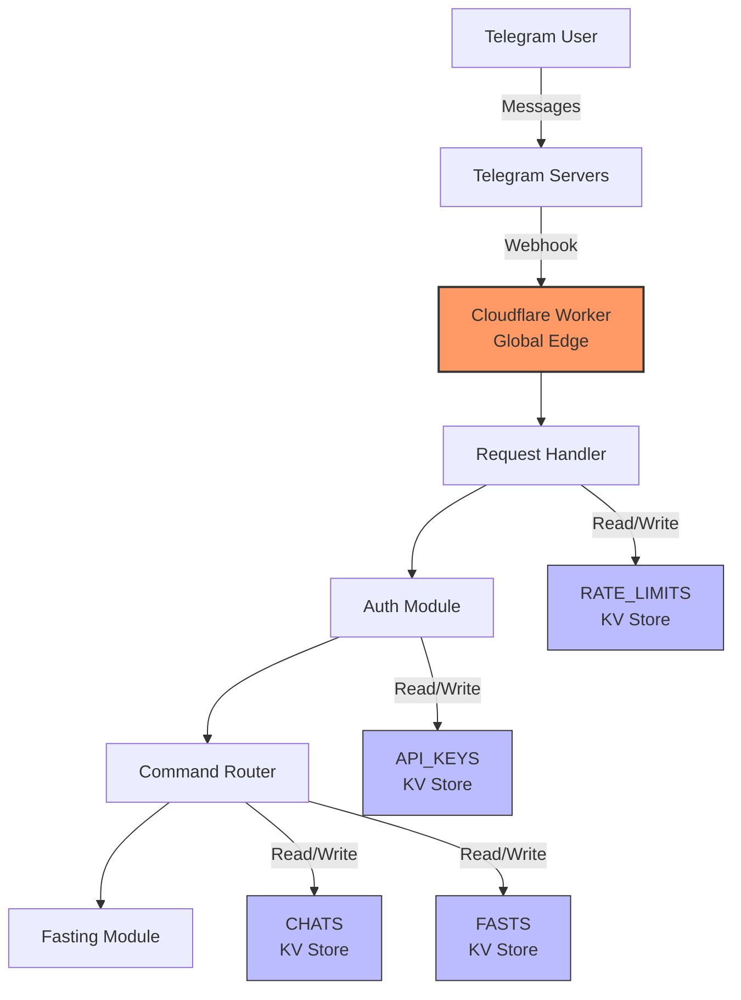

# ZenFast Telegram Bot

A lightweight fasting tracker for small groups of trusted users, built on Cloudflare Workers. Track fasts with simple commands, time adjustments, and friendly stats — fast, reliable, and inexpensive to run.

## Features

- ✅ Secure webhook-based Telegram bot with secret validation
- ✅ API key–based authentication (per chat)
- ✅ Fasting flows: start (/f), end (/end), status (/status)
- ✅ Time adjustments: relative (-2h, -30m, -1d) and absolute (14:00, 09:30)
- ✅ Weekly and monthly stats (/week, /month), recent stats (/stats)
- ✅ Per-user timezone configuration (/timezone)
- ✅ Inline buttons (Start/End) for quick actions
- ✅ TypeScript with strict settings and comprehensive tests
- ✅ Automated setup scripts and Cloudflare Workers deployment
- ✅ KV storage for API keys, chats, rate limits, and fasts

## Architecture Overview



### Components

- **Telegram Webhook**: Receives updates via HTTPS POST
- **Request Handler**: Validates webhooks and routes updates
- **Auth Module**: API key validation and chat authentication
- **Command Router**: Routes commands (/start, /status, /f, /end, /stats, /timezone, /week, /month)
- **Fasting Module**: User data, current fast, history, stats
- **KV Stores**: API_KEYS, CHATS, RATE_LIMITS, FASTS

## Quick Start

### One-Command Deployment

```bash
# Clone and deploy in under 5 minutes
git clone <repository-url>
cd zenfast
npm install
cp .env.example .env
# Edit .env with your values (see Prerequisites below), then:
npm run deploy:full
```

### Prerequisites

Before deploying, you need:

1. **Node.js 18+** installed
2. **Cloudflare account** with Workers access
3. **Telegram bot** created via [@BotFather](https://t.me/BotFather)

**Required .env values:**
- `CLOUDFLARE_ACCOUNT_ID` - Get from `npx wrangler whoami`
- `BOT_TOKEN` - From @BotFather
- `WEBHOOK_SECRET` - Generate with `openssl rand -hex 32`
- `WORKER_ROUTE` - Your deployed Workers URL (e.g., https://zenfast.your-subdomain.workers.dev)

Note:
- `BOT_USERNAME` is configured in wrangler.toml under [vars].
- For deployed workers, set secrets via Wrangler, not .env:
  - `echo "$BOT_TOKEN" | npx wrangler secret put BOT_TOKEN --silent`
  - `echo "$WEBHOOK_SECRET" | npx wrangler secret put WEBHOOK_SECRET --silent`

> 📖 See the [complete deployment guide](docs/deployment.md) for detailed steps and troubleshooting.

## API Key Management

### Generate API Keys

Create API keys for users to access the bot:

```bash
# Generate a new API key
npm run generate-key -- --name "User Name" --expiry "2024-12-31"

# For local testing (stores in local KV)
npm run generate-key -- --name "Test User" --expiry "2024-12-31" --local
```

**Important notes:**
- API keys use 5-word format (e.g., "apple-brave-cloud-dance-eagle")
- Keys are hashed with SHA-256 before storage
- Original keys cannot be recovered — save them securely
- Expiry date must be in YYYY-MM-DD format and in the future
- Keys are stored in the API_KEYS KV namespace

### Key Security

- Keys provide ~55 bits of entropy (5 words × 2000-word dictionary)
- Only SHA-256 hashes are stored in KV
- Keys are displayed only once during generation
- Expiry dates enforce time-based access control

## Command Reference

- `/start` — Begin authentication flow; shows current auth status if already authenticated.
- `/status` — Display API key name, expiry, and who authenticated the chat.
- `/f [time]` or `/fast [time]` — Start a fast now or at an adjusted time.
  - Relative formats: `-2h`, `-30m`, `-1d`
  - Absolute formats: `14:00`, `09:30` (interpreted in your timezone)
  - Invalid inputs produce errors like: `❌ Invalid time format: ...`
- `/end [time]` — End your current fast now or at an adjusted time.
  - Validation prevents ending before it started or in the future.
- `/stats` — Show recent fasts (duration and relative end time).
- `/week` — Weekly summary: total fasts, total hours, average, longest.
- `/month` — Monthly summary: total fasts, total hours, average, longest.
- `/timezone [IANA]` — Set or display timezone (e.g., `Europe/Paris`, `America/New_York`).

Tips:
- Use inline buttons: "🚀 Start Fast" and "🛑 End Fast" appear contextually.
- Default timezone is Europe/Paris until changed with /timezone.

## Development

### Local Development

```bash
npm run dev
# Worker runs at http://localhost:8787
```

### Testing and Build

```bash
# Run unit tests
npm test

# Type-check TypeScript files including tests
npm run typecheck

# Build (emit to dist)
npm run build
```

## Project Structure

```
zenfast/
├── src/           # TypeScript source code
├── test/          # Unit and integration tests
├── scripts/       # CLI tools and utilities
├── specs/         # Requirements and technical design
├── docs/          # Deployment and operations docs
├── package.json
├── tsconfig.json
├── wrangler.toml
└── .env.example
```

## API Details

### Webhook Endpoint

- **URL**: `https://your-worker.workers.dev/webhook`
- **Method**: POST
- **Security**: Validates `X-Telegram-Bot-Api-Secret-Token` header
- **Response**: 200 OK to Telegram (best practice)

### Message Routing

- **Private chats**: All text messages are processed
- **Groups/supergroups**: Process only when:
  - The message contains a bot command entity
  - The bot is mentioned (`@BOT_USERNAME`) via entity or plain text
  - The message is a reply to the bot

## NPM Scripts

| Script | Description |
|--------|-------------|
| `npm run dev` | Start local development server |
| `npm test` | Run unit tests |
| `npm run build` | Compile TypeScript |
| `npm run typecheck` | Type-check all TypeScript files including tests |
| `npm run deploy` | Deploy to Cloudflare Workers |
| `npm run setup-kv` | Create/verify KV namespaces and update wrangler.toml |
| `npm run setup-webhook -- --status` | Show current Telegram webhook status |
| `npm run setup-webhook -- --force` | Reconfigure Telegram webhook |
| `npm run deploy:full` | Orchestrated end-to-end deploy |
| `npm run generate-key` | Generate API keys for users |

## Operations

### Health Check
```bash
curl https://your-worker.workers.dev/health
```

### Monitoring
```bash
npx wrangler tail  # Live logs
```

### Troubleshooting
```bash
npm run setup-webhook -- --status          # Check webhook
npx wrangler whoami                        # Verify Cloudflare auth
```

## Security

- Webhook validation using secret token
- No sensitive data logged; errors surfaced to stderr in tests are expected
- Secrets managed via Wrangler for deployed worker

## Documentation

- [Deployment Guide](docs/deployment.md) - Detailed deployment instructions
- [Cost Analysis](docs/cost-analysis.md) - Operational cost breakdown
- [API Specification](specs/tdd-001.md) - Technical design document
- [Product Requirements](specs/prd-001.md) - Feature specifications

## Contributing

1. Make changes to TypeScript files in `src/`
2. Add tests in `test/`
3. Run `npm test` and `npm run typecheck`
4. Test locally with `npm run dev`
5. Deploy with `npm run deploy`
