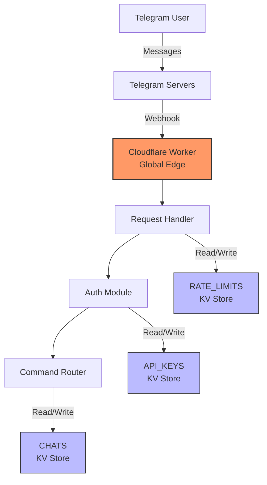

# ZenFast Telegram Bot

A minimal Telegram bot for small groups of trusted users, built on Cloudflare Workers. This bot demonstrates echo functionality as a foundation for future features.

## Features

- ✅ Webhook-based Telegram bot with security validation
- ✅ Echo functionality: responds "You said: [message]" to any text message
- ✅ Works in private chats and group conversations
- ✅ TypeScript implementation with comprehensive tests
- ✅ Automated setup scripts for quick deployment
- ✅ Cloudflare Workers runtime for global edge performance
- ✅ API key generation and management system

## Architecture Overview



### Components

- **Telegram Webhook**: Receives updates via HTTPS POST
- **Request Handler**: Validates webhooks and processes messages  
- **Auth Module**: API key validation and chat authentication
- **Command Router**: Handles bot commands (/start, /help, etc.)
- **KV Stores**: Persistent storage for keys, chat state, and rate limits

## Quick Start

### One-Command Deployment

```bash
# Clone and deploy in under 5 minutes
git clone <repository-url>
cd zenfast
npm install
cp .env.example .env
# Edit .env with your values (see Prerequisites below), then:
npm run deploy:full
```

### Prerequisites

Before deploying, you need:

1. **Node.js 18+** installed
2. **Cloudflare account** with Workers access
3. **Telegram bot** created via [@BotFather](https://t.me/BotFather)

**Required .env values:**
- `CLOUDFLARE_ACCOUNT_ID` - Get from `npx wrangler whoami`
- `BOT_TOKEN` - From @BotFather
- `WEBHOOK_SECRET` - Generate with `openssl rand -hex 32`
- `BOT_USERNAME` - Your bot's username (set in wrangler.toml)

**That's it!** The `deploy:full` script handles everything else automatically.

> 📖 **Need help?** See the [complete deployment guide](docs/deployment.md) for detailed instructions, troubleshooting, and manual deployment steps.

## API Key Management

### Generate API Keys

Create API keys for users to access the bot:

```bash
# Generate a new API key
npm run generate-key -- --name "User Name" --expiry "2024-12-31"

# For local testing (stores in local KV)
npm run generate-key -- --name "Test User" --expiry "2024-12-31" --local
```

**Important notes:**
- API keys use 5-word format (e.g., "apple-brave-cloud-dance-eagle")
- Keys are hashed with SHA-256 before storage
- Original keys cannot be recovered - save them securely
- Expiry date must be in YYYY-MM-DD format and in the future
- Keys are stored in the API_KEYS KV namespace

### Key Security

- Keys provide ~55 bits of entropy (5 words × 2000-word dictionary)
- Only SHA-256 hashes are stored in KV
- Keys are displayed only once during generation
- Expiry dates enforce time-based access control

## Development

### Local Development

```bash
# Start local development server
npm run dev
# Worker runs at http://localhost:8787
```

### Testing

```bash
# Run unit tests
npm test

# Test specific file
npm test webhook.test.ts

# Type-check TypeScript files including tests
npm run typecheck
```

### Manual Verification

Use the deployment verification commands from the troubleshooting section below.

## Project Structure

```
zenfast/
├── src/           # TypeScript source code
├── test/          # Unit and integration tests
├── scripts/       # CLI tools and utilities
├── specs/         # Requirements and technical design
├── package.json
├── tsconfig.json
├── wrangler.toml
└── .env.example
```

## API Details

### Webhook Endpoint

- **URL**: `https://your-worker.workers.dev/webhook`
- **Method**: POST
- **Security**: Validates `X-Telegram-Bot-Api-Secret-Token` header
- **Response**: Always returns 200 OK to Telegram (best practice)

### Message Processing

- **Private chats**: Processes all text messages
- **Group chats**: Processes only messages that:
  - Contain bot commands (detected via Telegram entities)
  - Mention the bot `@BOT_USERNAME` (detected via Telegram entities or text fallback)
  - Are replies to messages sent by the bot (detected via bot ID from token)

**Group Chat Examples:**
- ✅ `/start` - Bot command
- ✅ `@ZenFastBot hello` - Bot mention with entity
- ✅ `hello @ZenFastBot` - Bot mention in text
- ✅ Replying to a bot message - Reply detection
- ❌ `Regular group message` - Ignored
- ❌ `@OtherBot hello` - Different bot mention

### Echo Functionality

All processed messages receive a response:
```
You said: [original message]
```

## NPM Scripts

| Script | Description |
|--------|-------------|
| `npm run dev` | Start local development server |
| `npm test` | Run unit tests |
| `npm run build` | Compile TypeScript |
| `npm run typecheck` | Type-check all TypeScript files including tests |
| `npm run deploy` | Deploy to Cloudflare Workers |
| `npm run generate-key` | Generate API keys for users |

## Quick Troubleshooting

**Bot not responding?**
```bash
npm run setup-webhook -- --status  # Check webhook
npx wrangler tail                   # View logs
```

**Need help?** See the [deployment guide](docs/deployment.md) for comprehensive troubleshooting.

## Security

- Webhook validation using secret token
- No sensitive data logged
- Direct Telegram API calls (no third-party SDKs)
- Environment variables for all secrets

## Next Steps

This echo bot with API key generation provides the foundation for implementing:

1. **Authentication system** (API key validation - partially complete)
2. **Rate limiting**
3. **Custom commands**
4. **Shared context features**
5. **User management and permissions**

See `specs/tdd-001.md` for the full technical design.

## Operations

### Health Check
```bash
curl https://your-worker.workers.dev/health
```

### Monitoring
```bash
npx wrangler tail  # Live logs
```

### Key Commands
| Command | Description |
|---------|-------------|
| `npm run deploy:full` | Complete deployment |
| `npm run setup-webhook -- --status` | Check webhook |
| `npm run generate-key -- --name "User" --expiry "2024-12-31"` | Generate API key |

### Cost
- **Typical usage**: $0/month (free tier)
- **Heavy usage**: < $5/month

See [cost analysis](docs/cost-analysis.md) and [deployment guide](docs/deployment.md) for details.

## Documentation

- [Deployment Guide](docs/deployment.md) - Detailed deployment instructions
- [Cost Analysis](docs/cost-analysis.md) - Operational cost breakdown
- [API Specification](specs/tdd-001.md) - Technical design document
- [Product Requirements](specs/prd-001.md) - Feature specifications

## Contributing

1. Make changes to TypeScript files in `src/`
2. Add tests in `test/`
3. Run `npm test` to verify
4. Test locally with `npm run dev`
5. Deploy with `npm run deploy`
