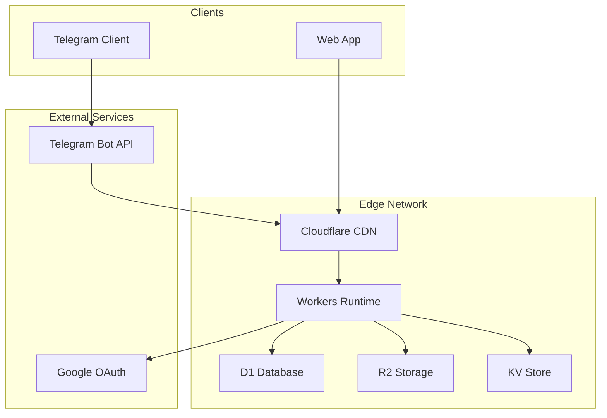

# ZenFast Infrastructure Specification - Cloudflare Stack

## Executive Summary

This document outlines the infrastructure architecture for ZenFast using Cloudflare's edge computing platform. The solution prioritizes cost-effectiveness ($0-5/month), global performance through edge deployment, and operational simplicity while maintaining the flexibility to scale.

## Architecture Overview



## Technology Stack

### Runtime Environment
- **Platform**: Cloudflare Workers
- **Language**: TypeScript (recommended) or Go compiled to WASM
- **Framework**: Hono (lightweight, Workers-optimized)
- **API Format**: REST with JSON (as per specs/api.md)

### Data Layer
- **Primary Database**: Cloudflare D1 (SQLite at the edge)
- **Session Store**: Workers KV
- **Object Storage**: Cloudflare R2
- **Cache**: Workers Cache API

### Authentication
- **Strategy**: JWT with social OAuth providers
- **Providers**: Google OAuth 2.0 (primary), extensible to others
- **Session Management**: Stateless JWT with KV-backed refresh tokens

## Detailed Component Specifications

### 1. Cloudflare Workers (Compute)

**Configuration**:
```toml
# wrangler.toml
name = "zenfast-api"
main = "src/index.ts"
compatibility_date = "2024-01-01"

[env.production]
routes = [
  { pattern = "api.zenfast.eu/*", zone_name = "zenfast.eu" }
]

[[d1_databases]]
binding = "DB"
database_name = "zenfast-prod"
database_id = "xxx-xxx-xxx"

[[kv_namespaces]]
binding = "SESSIONS"
id = "xxx-xxx-xxx"

[[r2_buckets]]
binding = "STORAGE"
bucket_name = "zenfast-storage"
```

**Resource Limits**:
- CPU: 10ms (50ms on paid plan)
- Memory: 128MB
- Request size: 100MB
- Subrequests: 50 (1000 on paid plan)

**Deployment Strategy**:
- GitOps via GitHub Actions
- Staging environment on separate subdomain
- Blue-green deployments using Cloudflare's gradual rollout

### 2. D1 Database (SQLite)

**Schema Design**:
```sql
-- Users table
CREATE TABLE users (
    id TEXT PRIMARY KEY,
    email TEXT UNIQUE NOT NULL,
    name TEXT NOT NULL,
    google_id TEXT UNIQUE,
    created_at TIMESTAMP DEFAULT CURRENT_TIMESTAMP,
    updated_at TIMESTAMP DEFAULT CURRENT_TIMESTAMP
);

-- Fasts table
CREATE TABLE fasts (
    id TEXT PRIMARY KEY,
    user_id TEXT NOT NULL,
    started_at TIMESTAMP NOT NULL,
    ended_at TIMESTAMP,
    created_at TIMESTAMP DEFAULT CURRENT_TIMESTAMP,
    updated_at TIMESTAMP DEFAULT CURRENT_TIMESTAMP,
    FOREIGN KEY (user_id) REFERENCES users(id) ON DELETE CASCADE,
    -- Ensure one fast per day constraints
    UNIQUE(user_id, date(started_at)),
    UNIQUE(user_id, date(ended_at))
);

-- Indexes for performance
CREATE INDEX idx_fasts_user_id ON fasts(user_id);
CREATE INDEX idx_fasts_started_at ON fasts(started_at);
CREATE INDEX idx_fasts_ended_at ON fasts(ended_at);
```

**Backup Strategy**:
- D1 automatic backups (point-in-time recovery)
- Daily exports to R2 via scheduled Workers
- 30-day retention policy

**Migration Strategy**:
```typescript
// migrations/001_initial.sql
// migrations/002_add_indexes.sql
// Applied via wrangler d1 migrations
```

### 3. Authentication Implementation

**JWT Structure**:
```typescript
interface JWTPayload {
  sub: string;      // user_id
  email: string;
  name: string;
  iat: number;
  exp: number;      // 15 minutes
  jti: string;      // JWT ID for revocation
}

interface RefreshToken {
  userId: string;
  tokenId: string;
  createdAt: number;
  expiresAt: number; // 30 days
}
```

**OAuth Flow**:
1. Client redirects to Google OAuth
2. Google redirects back with code
3. Worker exchanges code for tokens
4. Worker creates/updates user record
5. Worker issues JWT + refresh token
6. Refresh token stored in KV

**Security Considerations**:
- JWT signed with ES256 (ECDSA)
- Refresh tokens in KV with automatic expiration
- CORS configured for specific origins
- Rate limiting via Cloudflare rules

### 4. API Implementation

**Route Structure**:
```typescript
// src/routes/auth.ts
app.post('/api/v1/auth/google', googleOAuthHandler);
app.post('/api/v1/auth/refresh', refreshTokenHandler);
app.post('/api/v1/auth/logout', logoutHandler);

// src/routes/fasts.ts
app.post('/api/v1/fasts', authenticate, createFast);
app.get('/api/v1/fasts', authenticate, listFasts);
app.get('/api/v1/fasts/current', authenticate, getCurrentFast);
app.patch('/api/v1/fasts/:id', authenticate, updateFast);
app.delete('/api/v1/fasts/:id', authenticate, deleteFast);
```

**Middleware Stack**:
1. CORS handling
2. Request ID generation
3. Request logging
4. Authentication
5. Rate limiting
6. Error handling

### 5. R2 Object Storage

**Use Cases**:
- User profile pictures (future)
- Data exports (CSV, JSON)
- Backup storage
- Static assets

**Configuration**:
```typescript
interface R2Config {
  bucket: "zenfast-storage";
  publicUrl: "https://storage.zenfast.eu";
  folders: {
    exports: "exports/",
    backups: "backups/",
    profiles: "profiles/"
  };
}
```

**Access Pattern**:
- Presigned URLs for direct uploads
- CDN-cached public assets
- Lifecycle rules for automatic cleanup

### 6. Monitoring and Observability

**Cloudflare Analytics**:
- Worker metrics (requests, errors, CPU time)
- D1 query performance
- R2 bandwidth usage

**Custom Metrics**:
```typescript
// Using Workers Analytics Engine
await env.ANALYTICS.writeDataPoint({
  blobs: ["fast_created", userId],
  doubles: [1],
  indexes: ["event_type", "user_id"]
});
```

**Error Tracking**:
- Structured logging to Workers Logs
- Integration with external service (e.g., Sentry)
- Alert rules via Cloudflare notifications

## Cost Analysis

### Free Tier Limits
| Service | Free Tier | Estimated Usage | Cost at Scale |
|---------|-----------|-----------------|---------------|
| Workers | 100k req/day | 1k req/day | $0 |
| D1 | 5GB storage | 100MB | $0 |
| KV | 100k reads/day | 5k reads/day | $0 |
| R2 | 10GB storage | 1GB | $0 |

### Scaling Costs
- 1-1000 users: $0/month
- 1000-10k users: ~$5/month (Workers Paid)
- 10k-100k users: ~$20-50/month

### Cost Optimization Strategies
1. Aggressive caching (1-hour JWT expiry)
2. Batch operations where possible
3. Client-side data validation
4. Efficient query patterns

## Security Architecture

### Network Security
- All traffic via Cloudflare proxy
- Automatic DDoS protection
- WAF rules for common attacks
- Bot protection on auth endpoints

### Application Security
- Input validation via Zod schemas
- SQL injection prevention (parameterized queries)
- XSS protection (CSP headers)
- Secrets in environment variables

### Data Security
- Encryption at rest (D1, R2, KV)
- Encryption in transit (TLS 1.3)
- PII handling compliance
- GDPR-ready data deletion

## Deployment Process

### Local Development
```bash
# Install dependencies
npm install

# Run locally with miniflare
npm run dev

# Run tests
npm test

# Deploy to staging
npm run deploy:staging
```

### CI/CD Pipeline
```yaml
# .github/workflows/deploy.yml
name: Deploy to Cloudflare
on:
  push:
    branches: [main]
jobs:
  deploy:
    runs-on: ubuntu-latest
    steps:
      - uses: actions/checkout@v3
      - uses: cloudflare/wrangler-action@v3
        with:
          apiToken: ${{ secrets.CF_API_TOKEN }}
```

### Rollback Strategy
- Cloudflare deployment history
- One-click rollback via dashboard
- Automated rollback on error spike

## Migration and Scaling Path

### When to Migrate
- D1 approaching 10GB limit
- Need for complex queries (joins, analytics)
- Requiring >50ms CPU time
- Multi-region write requirements

### Migration Options
1. **Hybrid Approach**: Keep Workers, migrate D1 to Neon/Supabase
2. **Full Migration**: Move to Cloud Run + CloudSQL
3. **Scale Up**: Cloudflare Enterprise (higher limits)

### Data Migration Strategy
```typescript
// Export script
async function exportToR2() {
  const data = await db.prepare("SELECT * FROM fasts").all();
  await env.STORAGE.put(`backups/${Date.now()}.json`, JSON.stringify(data));
}
```

## Operational Runbook

### Common Tasks
1. **Adding new OAuth provider**
   - Update OAuth configuration
   - Add provider-specific handler
   - Update JWT claims mapping

2. **Database schema changes**
   - Create migration file
   - Test in staging
   - Apply via wrangler

3. **Performance optimization**
   - Analyze D1 query logs
   - Add appropriate indexes
   - Implement caching layers

### Monitoring Checklist
- [ ] Worker error rate < 1%
- [ ] P95 response time < 200ms
- [ ] D1 storage usage < 80%
- [ ] KV operation errors
- [ ] R2 bandwidth usage

### Incident Response
1. Check Cloudflare status page
2. Review Worker logs
3. Check D1 query performance
4. Verify external service status
5. Implement fix or rollback

## Trade-offs and Decisions

### Why Cloudflare Workers over traditional servers?
- **Pro**: Global edge deployment, automatic scaling
- **Pro**: Integrated ecosystem (D1, R2, KV)
- **Pro**: Cost-effective at small scale
- **Con**: 10ms CPU limit requires efficient code
- **Con**: Limited debugging compared to traditional servers

### Why D1 over PostgreSQL?
- **Pro**: Zero operational overhead
- **Pro**: Integrated with Workers (low latency)
- **Pro**: Automatic backups
- **Con**: SQLite limitations (no complex queries)
- **Con**: Single region writes

### Why TypeScript over Go?
- **Pro**: Native Workers support
- **Pro**: Better ecosystem for web APIs
- **Pro**: Faster development cycle
- **Con**: Less type safety than Go
- **Con**: Potential performance overhead

## Conclusion

This architecture provides a solid foundation for ZenFast with minimal operational overhead and cost. The edge-first approach ensures global performance while maintaining simplicity. The clear migration path allows for growth without architectural rewrites.

Key success factors:
1. Leverage Cloudflare's integrated ecosystem
2. Design for eventual migration from day one
3. Prioritize simplicity over premature optimization
4. Monitor costs and usage proactively