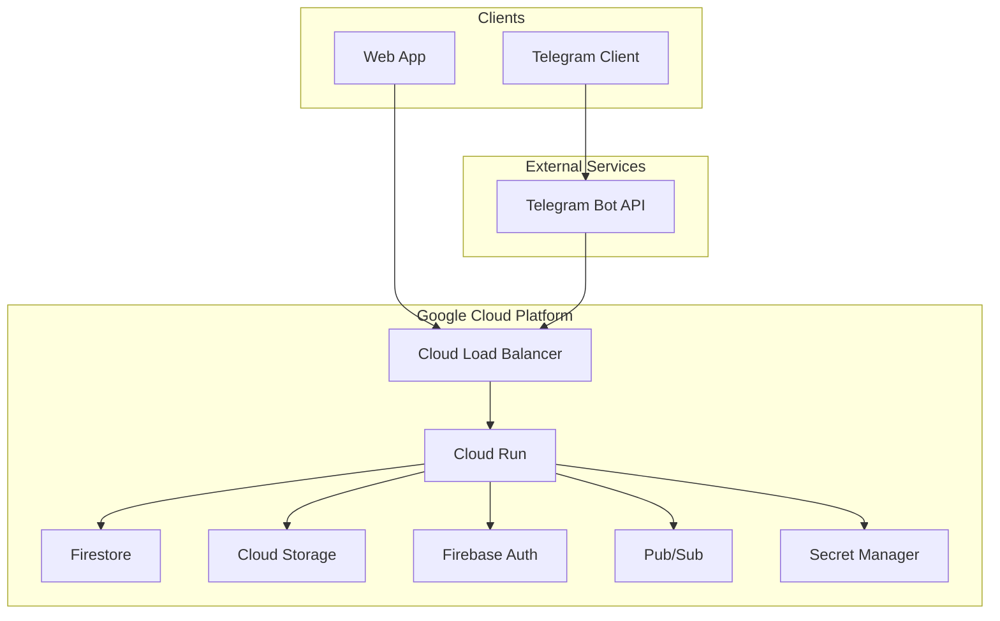

# ZenFast Infrastructure Specification - Google Cloud Platform

## Executive Summary

This document outlines the infrastructure architecture for ZenFast using Google Cloud Platform's serverless offerings. The solution leverages GCP's generous free tier, native Go support, and integrated services while maintaining costs under $10/month for small-scale usage.

## Architecture Overview



## Technology Stack

### Runtime Environment
- **Platform**: Cloud Run (fully managed)
- **Language**: Go 1.21+
- **Framework**: Standard library + Chi router
- **API Format**: REST with JSON (as per specs/api.md)

### Data Layer
- **Primary Database**: Firestore (NoSQL)
- **Alternative**: Cloud SQL PostgreSQL (if SQL preferred)
- **Object Storage**: Cloud Storage
- **Cache**: Firestore with TTL or Memorystore Redis

### Authentication
- **Service**: Firebase Authentication
- **Providers**: Google OAuth 2.0 (primary), extensible
- **Session Management**: Firebase Admin SDK with custom claims

## Detailed Component Specifications

### 1. Cloud Run (Compute)

**Service Configuration**:
```yaml
# service.yaml
apiVersion: serving.knative.dev/v1
kind: Service
metadata:
  name: zenfast-api
  annotations:
    run.googleapis.com/ingress: all
spec:
  template:
    metadata:
      annotations:
        autoscaling.knative.dev/minScale: "0"
        autoscaling.knative.dev/maxScale: "100"
        run.googleapis.com/cpu-throttling: "true"
    spec:
      serviceAccountName: zenfast-api@project.iam.gserviceaccount.com
      containerConcurrency: 1000
      timeoutSeconds: 300
      containers:
      - image: gcr.io/zenfast-prod/api:latest
        ports:
        - containerPort: 8080
        env:
        - name: PROJECT_ID
          value: zenfast-prod
        - name: FIRESTORE_DATABASE
          value: "(default)"
        resources:
          limits:
            cpu: "1"
            memory: "512Mi"
```

**Resource Allocation**:
- CPU: 1 vCPU (burstable)
- Memory: 512MB (adjustable)
- Concurrency: 1000 requests per instance
- Cold start: ~2 seconds (Go binary)
- Auto-scaling: 0-100 instances

**Deployment Strategy**:
- Container-based deployment via Cloud Build
- Traffic splitting for canary releases
- Automatic HTTPS with managed certificates

### 2. Firestore Database (NoSQL)

**Data Model Design**:
```go
// User document
type User struct {
    ID        string    `firestore:"-"`
    Email     string    `firestore:"email"`
    Name      string    `firestore:"name"`
    GoogleID  string    `firestore:"googleId"`
    CreatedAt time.Time `firestore:"createdAt"`
    UpdatedAt time.Time `firestore:"updatedAt"`
}

// Fast document
type Fast struct {
    ID        string     `firestore:"-"`
    UserID    string     `firestore:"userId"`
    StartedAt time.Time  `firestore:"startedAt"`
    EndedAt   *time.Time `firestore:"endedAt,omitempty"`
    CreatedAt time.Time  `firestore:"createdAt"`
    UpdatedAt time.Time  `firestore:"updatedAt"`
}

// Collection structure
// /users/{userId}
// /users/{userId}/fasts/{fastId}
```

**Composite Indexes**:
```yaml
# firestore.indexes.json
{
  "indexes": [
    {
      "collectionGroup": "fasts",
      "queryScope": "COLLECTION",
      "fields": [
        { "fieldPath": "userId", "order": "ASCENDING" },
        { "fieldPath": "startedAt", "order": "DESCENDING" }
      ]
    },
    {
      "collectionGroup": "fasts",
      "queryScope": "COLLECTION", 
      "fields": [
        { "fieldPath": "userId", "order": "ASCENDING" },
        { "fieldPath": "endedAt", "order": "DESCENDING" }
      ]
    }
  ]
}
```

**Security Rules**:
```javascript
rules_version = '2';
service cloud.firestore {
  match /databases/{database}/documents {
    // Users can only read/write their own data
    match /users/{userId} {
      allow read, write: if request.auth != null && request.auth.uid == userId;
      
      match /fasts/{fastId} {
        allow read, write: if request.auth != null && request.auth.uid == userId;
      }
    }
  }
}
```

**Backup Strategy**:
- Automated daily exports to Cloud Storage
- Point-in-time recovery (7 days)
- Cross-region replication for disaster recovery

### 3. Alternative: Cloud SQL PostgreSQL

**If SQL is preferred over NoSQL**:
```sql
-- Cloud SQL schema (similar to Cloudflare D1)
CREATE DATABASE zenfast;

CREATE TABLE users (
    id UUID PRIMARY KEY DEFAULT gen_random_uuid(),
    email VARCHAR(255) UNIQUE NOT NULL,
    name VARCHAR(255) NOT NULL,
    google_id VARCHAR(255) UNIQUE,
    created_at TIMESTAMP DEFAULT CURRENT_TIMESTAMP,
    updated_at TIMESTAMP DEFAULT CURRENT_TIMESTAMP
);

CREATE TABLE fasts (
    id UUID PRIMARY KEY DEFAULT gen_random_uuid(),
    user_id UUID NOT NULL REFERENCES users(id) ON DELETE CASCADE,
    started_at TIMESTAMP NOT NULL,
    ended_at TIMESTAMP,
    created_at TIMESTAMP DEFAULT CURRENT_TIMESTAMP,
    updated_at TIMESTAMP DEFAULT CURRENT_TIMESTAMP,
    CONSTRAINT unique_start_date UNIQUE (user_id, DATE(started_at)),
    CONSTRAINT unique_end_date UNIQUE (user_id, DATE(ended_at))
);

-- Indexes
CREATE INDEX idx_fasts_user_id ON fasts(user_id);
CREATE INDEX idx_fasts_dates ON fasts(started_at, ended_at);
```

**Cloud SQL Configuration**:
- Instance: db-f1-micro (1 vCPU, 0.6GB RAM)
- Storage: 10GB SSD
- Backup: Automated daily
- High Availability: Not needed initially
- Private IP with Cloud Run connector

### 4. Firebase Authentication

**Configuration**:
```go
// auth/firebase.go
type FirebaseAuth struct {
    app    *firebase.App
    client *auth.Client
}

func NewFirebaseAuth(ctx context.Context, projectID string) (*FirebaseAuth, error) {
    app, err := firebase.NewApp(ctx, &firebase.Config{
        ProjectID: projectID,
    })
    if err != nil {
        return nil, err
    }
    
    client, err := app.Auth(ctx)
    if err != nil {
        return nil, err
    }
    
    return &FirebaseAuth{app: app, client: client}, nil
}

// Custom claims for JWT
type CustomClaims struct {
    UserID string `json:"userId"`
    Email  string `json:"email"`
    Name   string `json:"name"`
}
```

**OAuth Flow Implementation**:
```go
// OAuth handler
func (h *AuthHandler) GoogleLogin(w http.ResponseWriter, r *http.Request) {
    // 1. Receive ID token from client
    idToken := r.Header.Get("Authorization")
    
    // 2. Verify with Firebase
    token, err := h.firebase.VerifyIDToken(r.Context(), idToken)
    if err != nil {
        return
    }
    
    // 3. Get/Create user
    user, err := h.userService.GetOrCreateByGoogleID(token.UID, token.Claims)
    
    // 4. Set custom claims
    claims := CustomClaims{
        UserID: user.ID,
        Email:  user.Email,
        Name:   user.Name,
    }
    
    h.firebase.SetCustomUserClaims(r.Context(), token.UID, claims)
}
```

### 5. Cloud Storage Configuration

**Bucket Setup**:
```bash
# Create bucket with uniform access
gsutil mb -p zenfast-prod -c standard -l us-central1 gs://zenfast-storage/

# Set lifecycle rules
gsutil lifecycle set lifecycle.json gs://zenfast-storage/
```

**Lifecycle Configuration**:
```json
{
  "lifecycle": {
    "rule": [
      {
        "action": {"type": "Delete"},
        "condition": {
          "age": 90,
          "matchesPrefix": ["temp/"]
        }
      },
      {
        "action": {"type": "SetStorageClass", "storageClass": "NEARLINE"},
        "condition": {
          "age": 30,
          "matchesPrefix": ["exports/"]
        }
      }
    ]
  }
}
```

**Signed URLs for Direct Upload**:
```go
func (s *StorageService) GenerateUploadURL(objectName string) (string, error) {
    opts := &storage.SignedURLOptions{
        Method:  "PUT",
        Expires: time.Now().Add(15 * time.Minute),
    }
    
    return s.bucket.SignedURL(objectName, opts)
}
```

### 6. API Implementation

**Project Structure**:
```
/cmd/api
  main.go
/internal
  /auth
    handler.go
    firebase.go
  /fast
    handler.go
    service.go
    repository.go
  /user
    model.go
    service.go
/pkg
  /middleware
    auth.go
    cors.go
    logging.go
  /database
    firestore.go
```

**Router Configuration**:
```go
func SetupRoutes(r chi.Router, h *Handlers) {
    r.Use(middleware.RequestID)
    r.Use(middleware.Logger)
    r.Use(middleware.Recoverer)
    r.Use(CORSMiddleware())
    
    r.Route("/api/v1", func(r chi.Router) {
        // Public routes
        r.Post("/auth/google", h.Auth.GoogleLogin)
        
        // Protected routes
        r.Group(func(r chi.Router) {
            r.Use(AuthMiddleware(h.Firebase))
            
            r.Post("/fasts", h.Fast.Create)
            r.Get("/fasts", h.Fast.List)
            r.Get("/fasts/current", h.Fast.GetCurrent)
            r.Get("/fasts/{id}", h.Fast.Get)
            r.Patch("/fasts/{id}", h.Fast.Update)
            r.Delete("/fasts/{id}", h.Fast.Delete)
        })
    })
}
```

### 7. Monitoring and Observability

**Cloud Monitoring Setup**:
```yaml
# monitoring/alerts.yaml
alertPolicy:
  displayName: "High Error Rate"
  conditions:
    - displayName: "Cloud Run 5xx errors"
      conditionThreshold:
        filter: |
          resource.type="cloud_run_revision"
          AND metric.type="run.googleapis.com/request_count"
          AND metric.labels.response_code_class="5xx"
        comparison: COMPARISON_GT
        thresholdValue: 10
        duration: 60s

  notificationChannels:
    - projects/zenfast-prod/notificationChannels/xxx
```

**Structured Logging**:
```go
type LogEntry struct {
    Severity  string                 `json:"severity"`
    Message   string                 `json:"message"`
    Trace     string                 `json:"logging.googleapis.com/trace"`
    Labels    map[string]string      `json:"labels"`
    Metadata  map[string]interface{} `json:"metadata"`
}

func (l *Logger) Error(ctx context.Context, msg string, err error) {
    entry := LogEntry{
        Severity: "ERROR",
        Message:  msg,
        Trace:    GetTraceID(ctx),
        Labels: map[string]string{
            "service": "zenfast-api",
        },
        Metadata: map[string]interface{}{
            "error": err.Error(),
        },
    }
    json.NewEncoder(os.Stdout).Encode(entry)
}
```

**Distributed Tracing**:
```go
import "cloud.google.com/go/trace"

func TracingMiddleware(next http.Handler) http.Handler {
    return http.HandlerFunc(func(w http.ResponseWriter, r *http.Request) {
        ctx, span := trace.StartSpan(r.Context(), r.URL.Path)
        defer span.End()
        
        next.ServeHTTP(w, r.WithContext(ctx))
    })
}
```

## Cost Analysis

### Free Tier Usage
| Service | Free Tier | Estimated Usage | Monthly Cost |
|---------|-----------|-----------------|--------------|
| Cloud Run | 2M requests, 360k GB-seconds | 30k requests | $0 |
| Firestore | 1GB storage, 50k reads/day | 100MB, 1k reads | $0 |
| Firebase Auth | 10k MAU | 100 users | $0 |
| Cloud Storage | 5GB, 1GB egress | 1GB storage | $0 |

### Scaling Costs
- 1-1000 users: $0-5/month
- 1000-10k users: $10-30/month
  - Cloud Run: ~$5 (compute)
  - Firestore: ~$10 (reads/writes)
  - Cloud Storage: ~$5 (storage/egress)
- 10k-100k users: $50-200/month

### Cost Optimization
1. **Cloud Run**: Set minimum instances to 0
2. **Firestore**: Denormalize data to reduce reads
3. **Storage**: Use lifecycle policies
4. **Monitoring**: Sample traces (not 100%)

## Security Architecture

### Network Security
- **VPC**: Cloud Run with private Firestore access
- **Ingress**: Cloud Armor for DDoS protection
- **SSL**: Managed certificates, TLS 1.3 only
- **IAM**: Least privilege service accounts

### Application Security
```go
// Input validation
type CreateFastRequest struct {
    StartedAt *time.Time `json:"started_at" validate:"omitempty,ltefield=Now"`
}

func ValidateRequest(v *validator.Validate, req interface{}) error {
    return v.Struct(req)
}

// SQL injection prevention (if using Cloud SQL)
query := `SELECT * FROM fasts WHERE user_id = $1 AND started_at > $2`
rows, err := db.Query(query, userID, startDate)
```

### Secrets Management
```go
// Using Secret Manager
func GetSecret(ctx context.Context, name string) (string, error) {
    client, err := secretmanager.NewClient(ctx)
    if err != nil {
        return "", err
    }
    defer client.Close()
    
    req := &secretmanagerpb.AccessSecretVersionRequest{
        Name: fmt.Sprintf("projects/%s/secrets/%s/versions/latest", projectID, name),
    }
    
    result, err := client.AccessSecretVersion(ctx, req)
    if err != nil {
        return "", err
    }
    
    return string(result.Payload.Data), nil
}
```

## Deployment Process

### CI/CD with Cloud Build

```yaml
# cloudbuild.yaml
steps:
  # Run tests
  - name: 'golang:1.21'
    entrypoint: 'go'
    args: ['test', './...']
    
  # Build container
  - name: 'gcr.io/cloud-builders/docker'
    args: ['build', '-t', 'gcr.io/$PROJECT_ID/zenfast-api:$COMMIT_SHA', '.']
    
  # Push to registry
  - name: 'gcr.io/cloud-builders/docker'
    args: ['push', 'gcr.io/$PROJECT_ID/zenfast-api:$COMMIT_SHA']
    
  # Deploy to Cloud Run
  - name: 'gcr.io/google.com/cloudsdktool/cloud-sdk'
    entrypoint: gcloud
    args:
      - 'run'
      - 'deploy'
      - 'zenfast-api'
      - '--image=gcr.io/$PROJECT_ID/zenfast-api:$COMMIT_SHA'
      - '--region=us-central1'
      - '--platform=managed'
      
  # Run migrations (if using Cloud SQL)
  - name: 'migrate/migrate'
    args:
      - '-path=/workspace/migrations'
      - '-database=postgresql://....'
      - 'up'

timeout: 1200s
```

### Local Development
```bash
# Run Firestore emulator
gcloud emulators firestore start

# Set environment
export FIRESTORE_EMULATOR_HOST=localhost:8080
export GOOGLE_APPLICATION_CREDENTIALS=path/to/key.json

# Run locally
go run cmd/api/main.go

# Deploy to staging
gcloud run deploy zenfast-api-staging \
  --source . \
  --region us-central1 \
  --allow-unauthenticated
```

## Migration and Scaling Path

### Vertical Scaling
1. Increase Cloud Run memory/CPU
2. Enable Cloud SQL connection pooling
3. Add Memorystore Redis for caching
4. Upgrade Firestore to multi-region

### Horizontal Scaling
1. Enable Cloud Run autoscaling
2. Add Cloud Load Balancer with CDN
3. Implement Pub/Sub for async tasks
4. Consider Cloud Spanner for global scale

### Migration Strategy
```go
// Dual-write pattern for migration
func (s *FastService) Create(ctx context.Context, fast *Fast) error {
    // Write to primary store
    if err := s.firestore.Create(ctx, fast); err != nil {
        return err
    }
    
    // Write to new store (async)
    go func() {
        if err := s.newStore.Create(context.Background(), fast); err != nil {
            log.Printf("Failed to write to new store: %v", err)
        }
    }()
    
    return nil
}
```

## Operational Runbook

### Health Checks
```go
// Health check endpoint
func HealthHandler(w http.ResponseWriter, r *http.Request) {
    ctx, cancel := context.WithTimeout(r.Context(), 5*time.Second)
    defer cancel()
    
    checks := map[string]bool{
        "firestore": checkFirestore(ctx),
        "storage":   checkStorage(ctx),
    }
    
    allHealthy := true
    for _, healthy := range checks {
        if !healthy {
            allHealthy = false
            break
        }
    }
    
    if !allHealthy {
        w.WriteHeader(http.StatusServiceUnavailable)
    }
    
    json.NewEncoder(w).Encode(checks)
}
```

### Common Operations
1. **Rolling back deployment**
   ```bash
   gcloud run services update-traffic zenfast-api \
     --to-revisions=PREVIOUS_REVISION=100
   ```

2. **Viewing logs**
   ```bash
   gcloud logging read "resource.type=cloud_run_revision \
     AND resource.labels.service_name=zenfast-api" \
     --limit 50 --format json
   ```

3. **Database backup**
   ```bash
   gcloud firestore export gs://zenfast-backups/$(date +%Y%m%d)
   ```

### Performance Tuning
1. **Connection pooling**
   ```go
   db.SetMaxOpenConns(25)
   db.SetMaxIdleConns(5)
   db.SetConnMaxLifetime(5 * time.Minute)
   ```

2. **Request optimization**
   - Batch Firestore reads
   - Use projections for partial data
   - Implement request coalescing

## Trade-offs and Decisions

### Why Cloud Run over App Engine or GKE?
- **Pro**: True pay-per-use, scales to zero
- **Pro**: Container-based (portable)
- **Pro**: No vendor lock-in
- **Con**: Cold starts (2-3 seconds)
- **Con**: Stateless only

### Why Firestore over Cloud SQL?
- **Pro**: No connection management
- **Pro**: Automatic scaling
- **Pro**: Real-time listeners (future)
- **Con**: NoSQL limitations
- **Con**: More expensive at scale

### Why Firebase Auth over Identity Platform?
- **Pro**: Simpler integration
- **Pro**: Client SDKs included
- **Pro**: Lower cost at small scale
- **Con**: Less flexibility
- **Con**: Firebase dependency

### Why Go over Node.js/Python?
- **Pro**: Better performance
- **Pro**: Lower memory usage (cheaper)
- **Pro**: Strong typing
- **Con**: Larger binary size
- **Con**: Fewer libraries

## Conclusion

This GCP-based architecture provides a robust, scalable foundation for ZenFast while leveraging Google's generous free tiers. The serverless approach minimizes operational overhead while providing clear paths for scaling. The use of managed services ensures high availability and security without additional complexity.

Key advantages:
1. Truly serverless with automatic scaling
2. Integrated security and monitoring
3. Strong free tier for initial growth
4. Clear migration paths as needs evolve