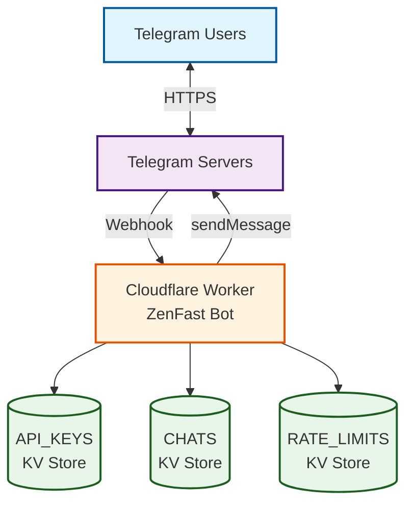

# ZenFast Technical Design Document

## Overview

This document outlines the technical implementation of ZenFast, a Telegram bot for small groups of trusted users. The design prioritizes simplicity and follows YAGNI (You Aren't Gonna Need It) principles.

**Reference**: Product Requirements Document - `/specs/prd-001.md`

## Architecture

### Platform
- **Runtime**: Cloudflare Workers
- **Storage**: Cloudflare Workers KV
- **Language**: TypeScript
- **External Dependencies**: Telegram Bot API only

### System Components



## Storage Design

### KV Namespaces

**1. API_KEYS Namespace**
- Stores API key metadata
- Key format: `sha256:<hash-of-api-key>` (SHA-256 hash of the 5-word phrase)
- Value structure:
```json
{
  "name": "Igor's phone",
  "expiry": "2024-12-31T23:59:59Z",
  "created": "2024-01-01T00:00:00Z"
}
```

**2. CHATS Namespace**
- Stores chat-to-API-key associations after successful authentication
- Key format: `<chat_id>` (Telegram chat ID, e.g., "123456789" for private chats, "-1001234567890" for groups)
- Value structure:
```json
{
  "api_key_hash": "sha256:a1b2c3d4e5f6...",  // SHA-256 hash of the authenticated key
  "authenticated_at": "2024-01-15T10:30:00Z",
  "authenticated_by": {
    "user_id": 987654321,
    "username": "alice",
    "first_name": "Alice"
  }
}
```

**3. RATE_LIMITS Namespace**
- Stores rate limiting data for failed authentication attempts
- Key format: `<chat_id>` (same as CHATS namespace)
- Value structure:
```json
{
  "failed_attempts": 3,
  "first_attempt_at": "2024-01-15T10:30:00Z",
  "last_attempt_at": "2024-01-15T10:32:00Z",
  "locked_until": "2024-01-15T10:47:00Z"
}
```
- TTL set to 24 hours after `locked_until` for automatic cleanup

**Important Notes**:
- Each chat (private or group) can only have ONE associated API key
- Once authenticated, ALL users in that chat share the same API key privileges
- Re-authentication with a different key overwrites the previous association
- No audit trail of previous keys (simplicity over history)
- Private chats have positive IDs, group chats have negative IDs

### Storage Operations
- API_KEYS and CHATS: No TTL (permanent storage)
- RATE_LIMITS: TTL set for automatic cleanup
- Expiry checking done in application logic
- All dates stored in ISO 8601 format (UTC)

## API Key Design

### Format
- 5 random words from a 2000-word dictionary
- Format: `word1-word2-word3-word4-word5`
- Example: `correct-horse-battery-staple-zebra`
- ~55 bits of entropy

### Storage Security
- Keys are stored as SHA-256 hashes in KV (not plaintext)
- Original key shown only once during generation
- Cannot recover lost keys (must generate new ones)

### Generation
- CLI tool generates keys and stores them directly in KV
- No API endpoint for key generation (security)
- Requires Cloudflare credentials to run

## TypeScript Type Definitions

### Storage Types
```typescript
// API_KEYS namespace value
interface ApiKeyData {
  name: string;
  expiry: string; // ISO 8601
  created: string; // ISO 8601
}

// CHATS namespace value
interface ChatAuthData {
  api_key_hash: string;
  authenticated_at: string; // ISO 8601
  authenticated_by: {
    user_id: number;
    username?: string;
    first_name: string;
  };
}

// RATE_LIMITS namespace value
interface RateLimitData {
  failed_attempts: number;
  first_attempt_at: string; // ISO 8601
  last_attempt_at: string; // ISO 8601
  locked_until?: string; // ISO 8601
}
```

### Telegram Types (subset used)
```typescript
interface Update {
  update_id: number;
  message?: Message;
  edited_message?: Message;
}

interface Message {
  message_id: number;
  from?: User;
  chat: Chat;
  date: number;
  text?: string;
  entities?: MessageEntity[];
  reply_to_message?: Message;
}

interface User {
  id: number;
  is_bot: boolean;
  first_name: string;
  username?: string;
}

interface Chat {
  id: number;
  type: 'private' | 'group' | 'supergroup' | 'channel';
}

interface MessageEntity {
  type: 'mention' | 'bot_command' | 'text_mention' | string;
  offset: number;
  length: number;
}
```

### Worker Environment
```typescript
interface Env {
  WEBHOOK_SECRET: string;
  API_KEYS: KVNamespace;
  CHATS: KVNamespace;
  RATE_LIMITS: KVNamespace;
}
```

## Authentication Flow

### Commands
- **/start** - Welcome message and authentication prompt
- **/status** - Check authentication status and expiry

### First-Time Authentication
```
User: "/start"
Bot: "Welcome to ZenFast! 🚀
Please authenticate by sending your API key."

User: "correct-horse-battery-staple-zebra"
Bot: [Check RATE_LIMITS KV for lockout]
Bot: [Hash provided key and check if hash exists in API_KEYS KV]
Bot: [Validate not expired]
Bot: [Store chat_id → api_key_hash in CHATS KV with user info]
Bot: [Clear any rate limit entries for this chat]
Bot: "Authentication successful! ✅
Authenticated as: Igor's phone
Expires: 2024-12-31"
```

### Subsequent Messages
```
User: "/start"
Bot: [Check CHATS KV for existing auth using chat_id]
Bot: [Retrieve api_key_hash from CHATS entry]
Bot: [Validate key not expired by checking API_KEYS KV]
Bot: "Welcome back! ✅
Authenticated as: Igor's phone
Expires: 2024-12-31"
```

### Failed Authentication with Rate Limiting
```
User: "wrong-key-attempt"
Bot: [Check RATE_LIMITS KV for existing lockout]
Bot: [If locked: "Too many failed attempts. Please try again after 2024-01-15 10:47"]
Bot: [Hash key and check API_KEYS - not found]
Bot: [Increment failed_attempts in RATE_LIMITS KV]
Bot: [If 3rd attempt: Set 15-minute lockout]
Bot: [If 5th attempt: Set 1-hour lockout]
Bot: [If 10th attempt: Set 24-hour lockout]
Bot: "Invalid API key. Please check and try again. (Attempt 3 of 10)"
```

### Edge Cases
- **Expired key**: "Your API key has expired. Please contact the bot owner for a new key."
- **Invalid key**: "Invalid API key. Please check and try again."
- **Group already authenticated**: "This group is already authenticated with 'Igor's phone'."
- **Rate limited**: "Too many failed attempts. Please try again after [timestamp]."

## Webhook Security

### Implementation
Using Telegram's recommended secret token approach:

1. Generate random secret during bot setup
2. Configure webhook with secret:
```typescript
setWebhook({
  url: "https://zenfast.example.workers.dev/webhook",
  secret_token: "random-secret-token-here"
})
```

3. Validate on every request:
```typescript
if (request.headers.get("X-Telegram-Bot-Api-Secret-Token") !== env.WEBHOOK_SECRET) {
  return new Response("Unauthorized", { status: 401 });
}
```

## Message Processing

### Scope
- **Private chats**: Process all messages after authentication
- **Group chats** (privacy mode enabled): Only process:
  - Messages mentioning @zenfast_bot
  - Commands starting with `/` (e.g., `/start`, `/status`)
  - Replies to bot messages
- **Channels**: Same as group chats

### Basic Flow
1. Receive webhook from Telegram
2. Validate webhook secret
3. Extract chat_id and message type from update
4. Check if message should be processed (private chat OR group mention/command/reply)
5. Check authentication status
6. If not authenticated, prompt for API key
7. If authenticated, process command or echo message (Phase 1)

## Environment Configuration

### Cloudflare Worker Environment Variables
```toml
# wrangler.toml
name = "zenfast"

[env.production]
vars = { WEBHOOK_SECRET = "your-secret-here" }

[[kv_namespaces]]
binding = "API_KEYS"
id = "your-kv-namespace-id-1"

[[kv_namespaces]]
binding = "CHATS"
id = "your-kv-namespace-id-2"

[[kv_namespaces]]
binding = "RATE_LIMITS"
id = "your-kv-namespace-id-3"
```

### Telegram Bot Configuration
- Create bot via @BotFather
- Keep group privacy mode ENABLED (default) for better privacy
- Set webhook URL after deployment
- Bot will receive in groups: mentions, commands, and replies

## Deployment Process

1. **Create KV namespaces**:
```bash
wrangler kv:namespace create "API_KEYS"
wrangler kv:namespace create "CHATS"
wrangler kv:namespace create "RATE_LIMITS"
```

2. **Generate and store API keys** (single command):
```bash
npm run generate-key -- --name "Igor's phone" --expiry "2024-12-31"
# Output: 
# Generated API key: correct-horse-battery-staple-zebra
# Key stored successfully for 'Igor's phone' (expires: 2024-12-31)
# Save this key securely - it cannot be recovered!
```

3. **Deploy worker**:
```bash
wrangler deploy
```

4. **Set webhook**:
```bash
curl https://api.telegram.org/bot<TOKEN>/setWebhook \
  -d "url=https://zenfast.example.workers.dev/webhook" \
  -d "secret_token=your-secret-here"
```

## Development & Local Testing

### Local Development Setup

1. **Install dependencies**:
```bash
npm install -g wrangler
npm install
```

2. **Environment setup**:
Create `.dev.vars` file (ignored by git):
```
WEBHOOK_SECRET=your-local-webhook-secret
```

3. **Run locally**:
```bash
wrangler dev
# Worker runs at http://localhost:8787
```

### Testing Strategy

1. **Unit tests**: Test authentication logic and message processing
```bash
npm test
```

2. **Local integration testing**:
```bash
# Test webhook with curl (no Telegram needed)
curl -X POST http://localhost:8787/webhook \
  -H "X-Telegram-Bot-Api-Secret-Token: your-local-webhook-secret" \
  -H "Content-Type: application/json" \
  -d '{"message":{"chat":{"id":123},"text":"Hello"}}'
```

3. **Testing with miniflare** (Cloudflare Worker emulator):
```bash
npm run test:miniflare
```

### Development Workflow

1. Make changes to TypeScript code
2. Test locally with `wrangler dev`
3. Run tests with `npm test`
4. Test webhook locally with curl
5. Deploy to production: `wrangler deploy`

### Concrete Test Scenarios

**Authentication Tests**:
1. Valid API key authentication
2. Invalid API key rejection
3. Expired API key handling
4. Rate limiting after 3, 5, and 10 attempts
5. Lockout enforcement and TTL cleanup
6. Re-authentication with different key

**Message Processing Tests**:
1. Private chat: All messages processed after auth
2. Group chat: Only @mentions processed
3. Group chat: Commands (/start, /status) processed
4. Group chat: Replies to bot processed
5. Group chat: Regular messages ignored
6. Unauthenticated message handling

**Command Tests**:
1. /start in unauthenticated chat
2. /start in authenticated chat
3. /status showing auth details
4. Invalid commands ignored

**Webhook Security Tests**:
1. Valid webhook secret accepted
2. Invalid webhook secret rejected (401)
3. Missing webhook secret rejected
4. Malformed request handling

**Edge Case Tests**:
1. Very long API keys truncated/rejected
2. Non-text messages ignored
3. Edited messages handled appropriately
4. Channel messages follow group rules
5. Concurrent authentication attempts

### Debugging Tips

- Use `console.log()` for local debugging (logs appear in terminal)
- Use `wrangler tail` to see production logs
- Test different Telegram message types locally:
```bash
# Test authentication
curl -X POST http://localhost:8787/webhook \
  -H "X-Telegram-Bot-Api-Secret-Token: your-local-webhook-secret" \
  -H "Content-Type: application/json" \
  -d '{"message":{"chat":{"id":123},"text":"correct-horse-battery-staple-zebra"}}'

# Test regular message (after auth)
curl -X POST http://localhost:8787/webhook \
  -H "X-Telegram-Bot-Api-Secret-Token: your-local-webhook-secret" \
  -H "Content-Type: application/json" \
  -d '{"message":{"chat":{"id":123},"text":"Hello bot!"}}'
```

## Error Handling

### Approach
- Return user-friendly error messages via Telegram
- No error logging (privacy, simplicity)
- Let Cloudflare handle infrastructure errors
- Respond with 200 OK even on application errors (Telegram best practice)

### Common Errors
- KV unavailable: "Service temporarily unavailable. Please try again."
- Invalid message format: Ignore silently
- Webhook validation failure: Return 401 (blocks request)

## Security Considerations

1. **No sensitive data in logs**: Worker doesn't log messages or API keys
2. **HTTPS only**: Enforced by Cloudflare Workers
3. **API key transmission**: One-time via Telegram's encrypted chat
4. **No key enumeration**: Can't list or discover valid keys
5. **Application-level rate limiting**: 
   - 3 failed attempts = 15-minute lockout
   - 5 failed attempts = 1-hour lockout
   - 10 failed attempts = 24-hour lockout
   - Automatic cleanup via KV TTL
6. **Infrastructure DDoS protection**: Cloudflare's built-in protection
7. **Public repository**: Never commit secrets (bot token, webhook secret, API keys) to the repository. Use environment variables and wrangler secrets for all sensitive data

## Performance Targets

- **Response time**: < 500ms for auth check + echo
- **Cold start**: < 50ms (Workers are fast)
- **Concurrent requests**: 50+ (Workers auto-scale)

## Limitations & Simplifications

1. **No command framework**: Just echo messages after auth
2. **No user management**: Owner manually manages keys
3. **No audit logging**: No tracking of who did what
4. **No key rotation helpers**: Users re-auth manually
5. **No backup/restore**: Rely on KV durability
6. **Single region**: Use Cloudflare's default
7. **No monitoring**: Users report issues directly

## Future Considerations

When extending the bot with actual commands:
1. Add command parsing after auth check
2. Store command state in KV if needed
3. Consider Durable Objects for complex state
4. Add structured logging for debugging

## Summary

This design delivers a minimal but functional authenticated Telegram bot that:
- Meets all PRD requirements
- Costs < $5/month (likely free tier)
- Deploys in minutes
- Requires minimal maintenance
- Provides a foundation for future features

The implementation focuses on getting a working bot quickly while maintaining security and reliability for the target use case of friends and family.
